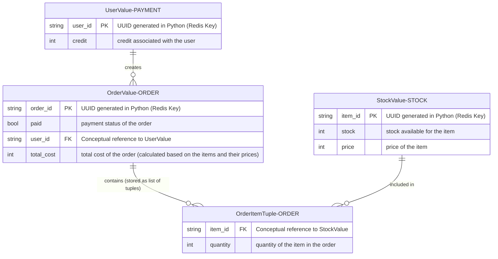

# RedisInsight

### Web view:

`http://localhost:5540/`

### Add Tables:

`redis://:redis@order-db:6379`

`redis://:redis@stock-db:6379`

`redis://:redis@payment-db:6379`

### Database Structure:

```mermaid
erDiagram
    %% Payment Microservice
    UserValue-PAYMENT {
        string user_id PK "UUID generated in Python (Redis Key)"
        int credit "credit associated with the user"
    }

    %% Stock Microservice
    StockValue-STOCK {
        string item_id PK "UUID generated in Python (Redis Key)"
        int stock "stock available for the item"
        int price "price of the item"
    }

    %% Order Microservice
    OrderValue-ORDER {
        string order_id PK "UUID generated in Python (Redis Key)"
        bool paid "payment status of the order"
        string user_id FK "Conceptual reference to UserValue"
        int total_cost "total cost of the order (calculated based on the items and their prices)"
    }

    %% Conceptual Junction for the list[tuple[str, int]] in OrderValue
    OrderItemTuple-ORDER {
        string item_id FK "Conceptual reference to StockValue"
        int quantity "quantity of the item in the order"
    }

    %% Relationships
    UserValue-PAYMENT ||--o{ OrderValue-ORDER : "creates"
    OrderValue-ORDER ||--o{ OrderItemTuple-ORDER : "contains (stored as list of tuples)"
    StockValue-STOCK ||--o{ OrderItemTuple-ORDER : "included in"
```

